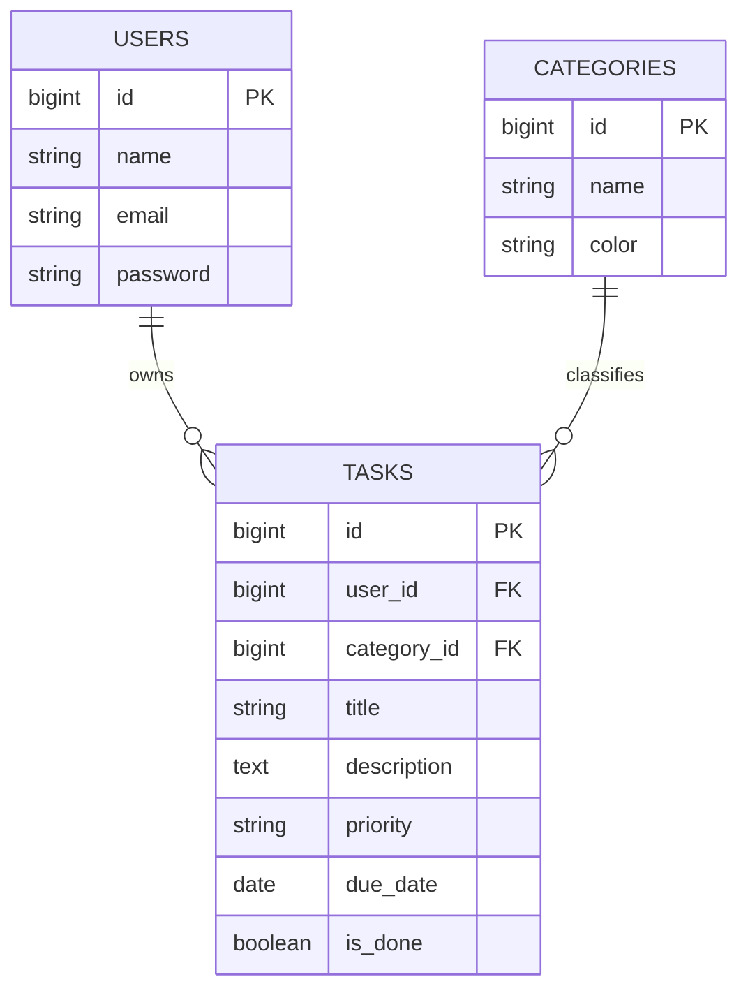

# Task Manager (Laravel)

Laravel で作成した、認証・認可・検索・並び替えを備えたタスク管理アプリです。
単純なCRUDから一歩進んで、実務でよく使う構成(ユーザー認証・リレーション・認可・自動テスト・CI)を一通り実装しています。


## デモアカウント

Seederを実行すると、以下のアカウントですぐに動作確認ができます。

| Email | Password |
|---|---|
| demo@example.com | password |

## 主な機能

- ユーザー認証(会員登録・ログイン・ログアウト)
- タスクのCRUD(作成・一覧・詳細・更新・削除)
- タスクはユーザーごとに管理(他人のタスクは見えない・編集できない)
- カテゴリ機能(タスクとカテゴリの1対多リレーション)
- 優先度(低 / 中 / 高)・期限日の設定、期限切れの自動ハイライト
- キーワード検索、状態・カテゴリでの絞り込み、カラムソート、ページネーション
- フォームリクエストによるバリデーション、日本語エラーメッセージ
- Policyによる認可(自分のタスク以外は403)
- Factory / Seederによるデモデータ投入
- PHPUnitによる自動テスト(認証・CRUD・認可)
- GitHub Actionsによる CI(push時に自動でテスト実行)

## 技術スタック

| 分類 | 使用技術 |
|---|---|
| バックエンド | PHP 8.3 / Laravel 11+ |
| フロントエンド | Blade / Bootstrap 5 |
| DB | MySQL(本番想定)/ SQLite(テスト) |
| テスト | PHPUnit(Feature Test) |
| CI | GitHub Actions |
| 認証・認可 | Laravel標準の Auth Facade / Policy |

## ER図



## セットアップ

1. Laravelプロジェクトを新規作成(まだ無ければ)

   ```bash
   composer create-project laravel/laravel task-manager
   cd task-manager
   ```

2. このリポジトリのファイルを、同じパスにコピー(上書き)する

   - `app/`
   - `database/`
   - `resources/views/`
   - `routes/web.php`
   - `tests/`

3. `.env` を用意してDBを設定し、キーを生成

   ```bash
   cp .env.example .env
   php artisan key:generate
   ```

4. マイグレーション + デモデータ投入

   ```bash
   php artisan migrate --seed
   ```

5. サーバー起動

   ```bash
   php artisan serve
   ```

6. ブラウザで `http://127.0.0.1:8000` へアクセスし、デモアカウントでログイン

## テストの実行方法

```bash
php artisan test
```

`phpunit.xml` はデフォルトでSQLiteのインメモリDBを使うよう設定されているため、
本番用DBに影響を与えずにテストできます。

## ルーティング一覧

| メソッド | URI | 認証 | 説明 |
|---|---|---|---|
| GET | / | - | /tasks へリダイレクト |
| GET | /login | ゲストのみ | ログイン画面 |
| POST | /login | ゲストのみ | ログイン処理 |
| GET | /register | ゲストのみ | 会員登録画面 |
| POST | /register | ゲストのみ | 会員登録処理 |
| POST | /logout | 要ログイン | ログアウト |
| GET | /tasks | 要ログイン | タスク一覧(検索・絞り込み・ソート対応) |
| GET | /tasks/create | 要ログイン | 作成フォーム |
| POST | /tasks | 要ログイン | 保存 |
| GET | /tasks/{task} | 要ログイン・本人のみ | 詳細 |
| GET | /tasks/{task}/edit | 要ログイン・本人のみ | 編集フォーム |
| PUT/PATCH | /tasks/{task} | 要ログイン・本人のみ | 更新 |
| DELETE | /tasks/{task} | 要ログイン・本人のみ | 削除 |

## ディレクトリ構成(抜粋)

```
app/
  Http/
    Controllers/    … AuthController, TaskController
    Requests/        … StoreTaskRequest, UpdateTaskRequest
  Models/            … User, Task, Category
  Policies/          … TaskPolicy(自分のタスクのみ操作可能にする認可)
database/
  migrations/
  factories/
  seeders/
resources/views/
  layouts/app.blade.php … 共通レイアウト(ナビバー・フラッシュメッセージ)
  auth/                  … ログイン・会員登録
  tasks/                 … 一覧・作成・編集・詳細
tests/Feature/
  AuthTest.php
  TaskTest.php
.github/workflows/laravel.yml … CI設定
```

## 実装で意識したポイント(ポートフォリオ用メモ)

- **認可(Authorization)をコントローラに書き散らさず Policy に集約**し、`$this->authorize()` で呼び出す構成にした
- **バリデーションを FormRequest に分離**し、コントローラの責務をHTTPの流れの制御に絞った
- **並び替えカラムをホワイトリスト方式で検証**し、任意カラム名を注入されないようにした
- ページネーションのリンクに検索条件を保持する `withQueryString()` を使い、UXを損なわないようにした
- Factory / Seeder を用意することで、**テストとデモデータ投入の両方**に同じ定義を再利用できるようにした
- 認証・CRUD・認可(他人のタスクは403になること)を、それぞれ **Featureテストとして明文化** した

## 今後の改善案

- Dockerによる開発環境の統一(docker-compose)
- タスクの担当者アサインなど、複数人での利用を想定した機能拡張
- Vue/ReactによるSPA化、またはLivewireでのリアルタイム更新
- メール認証・パスワードリセット機能の追加
- API化(Sanctumを使ったトークン認証)してモバイルアプリ対応

## ライセンス

[MIT License](./LICENSE)
